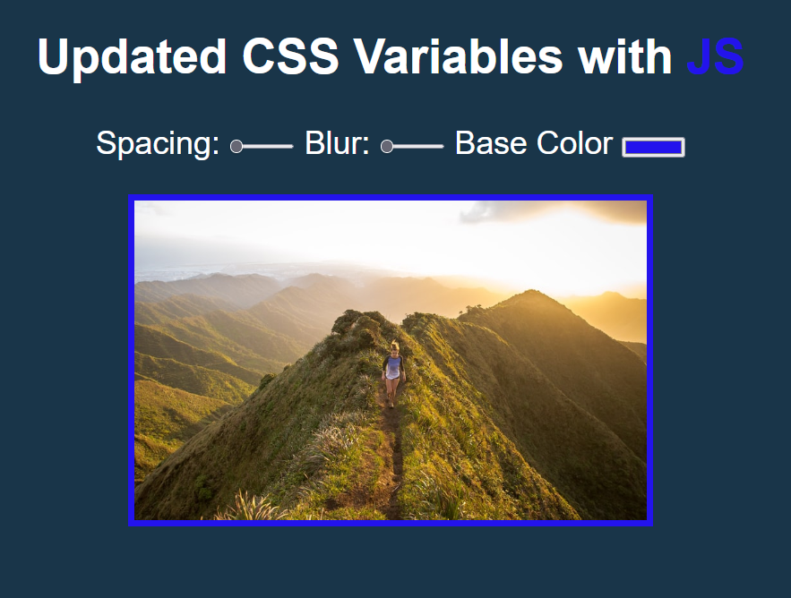
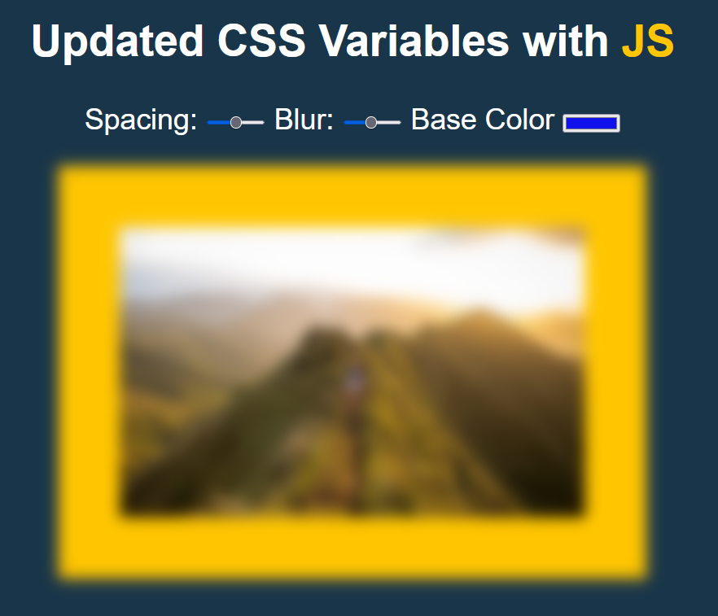

# JS-CSS-Variables

JavaScript CSS Variables

<!-- Live link to deployed app -->

Repository: https://github.com/Mdudzik92/JS-CSS-Variables  
Deployed app: https://mdudzik92.github.io/JS-CSS-Variables/

<!-- Technologies used -->

HTML, JavaScript, CSS, CSS Variables, ES6

<!-- Explanation of what the app is -->

This app uses CSS variables and JavaScript to alter an image. The user can change the photo's spacing by adding or shrinking it's padding amount, add blur or decrease the blur amount on the photo, or changing the color of the photo's background.

<!-- Screenshot -->

<!-- License -->

MIT

<!-- Contact information -->

Email: mdudzik92@gmail.com
